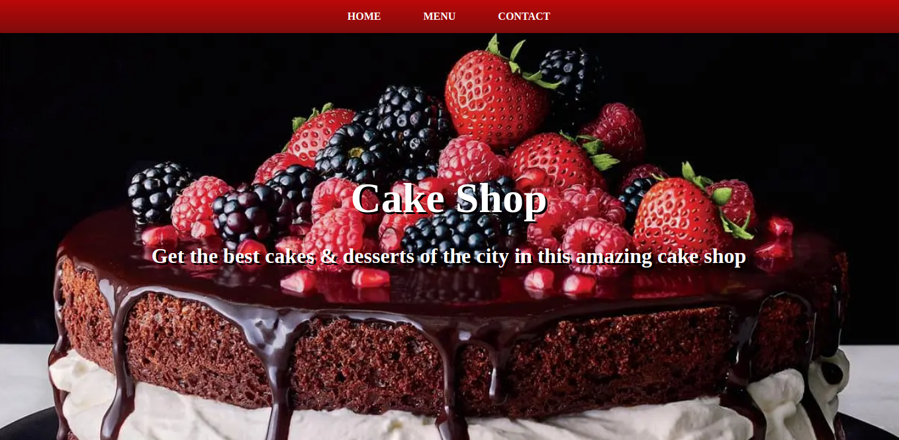

# Cake Shop Page

This is a restaurant page project. In this page we can see the restaurant name and slogan, its products and contact info. This page uses tabbed browsing for the UI.

## Built With

- Javascript (ES6)
- Webpack
- CSS
- ESLint

## Live demo

Check out this project on the [Live Demo Link](https://raw.githack.com/Miguelus373/Restaurant-Page/restaurant/dist/index.html#)

## Getting Started

To get a local copy up and running follow these simple steps.

### Install

- Open your Command Line or Terminal
- And clone this repo using this command: `https://github.com/Miguelus373/Restaurant-Page.git`

### Usage

Start a local server or open the dist/index.html file on your browser.

## Author

👤 **Miguel Uzcátegui**

- Github: [@miguelus373](https://github.com/miguelus373)
- Linkedin: [Miguel-Uzcátegui](https://www.linkedin.com/in/miguelus/)

## 🤝 Contributing

Contributions, issues and feature requests are welcome!

Feel free to check the [issues page](https://github.com/Miguelus373/Restaurant-Page/issues).

## Show your support

Give a ⭐️ if you like this project!

## 📝 License

This project is [MIT](lic.url) licensed.
